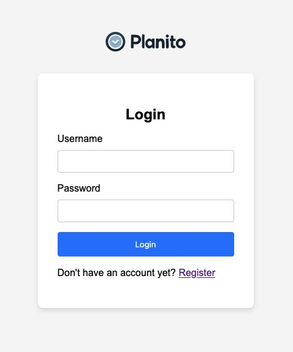

# Planito Application

## Registration Page

The registration page of the Planito application is designed to allow new users to create an account. The page is simple and user-friendly, ensuring a smooth registration process. Below is a detailed description of the registration page:

### Description

This registration page is crucial for new users to create an account on the Planito application. It ensures that users provide a username and a password, and confirms the password to avoid any mistakes. The design is clean and straightforward, making it easy for users to understand and complete the registration process. The inclusion of a sign-in link at the bottom provides a convenient way for existing users to navigate to the login page.

## Login Page

The login page of the Planito application allows existing users to sign in to their accounts. The page is designed to be clean and straightforward, ensuring that users can easily log in. Below is a detailed description of the login page:

### Description

This login page is essential for existing users to access their accounts on the Planito application. It ensures that users provide their username and password to authenticate themselves. The design is clean and intuitive, making it easy for users to log in. The inclusion of a register link at the bottom provides a convenient way for new users to navigate to the registration.

## Home Page

The home page of the Planito application is accessible only to logged-in users. This view allows users to create, complete, modify, and delete todos. Below is a detailed description of the home page:

### Description

This home page provides a comprehensive view of the user's todos, allowing for efficient task management. Users can easily create new tasks, mark tasks as completed, modify existing tasks, and delete tasks they no longer need. The design is intuitive and user-friendly, ensuring a seamless experience for managing todos.

